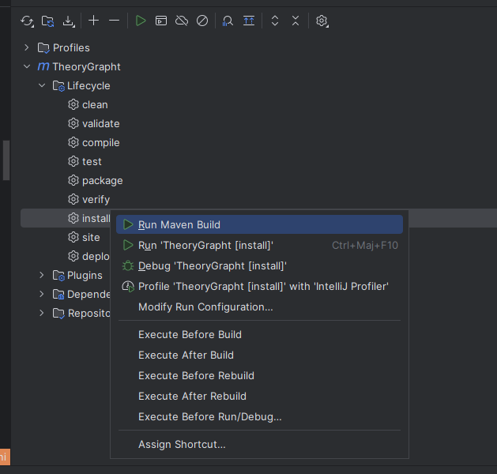
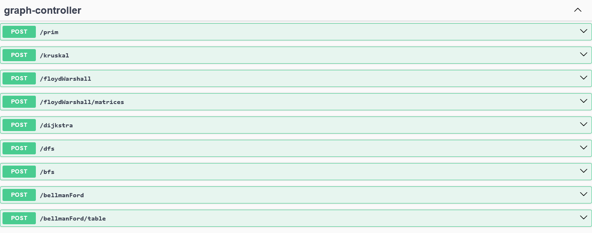
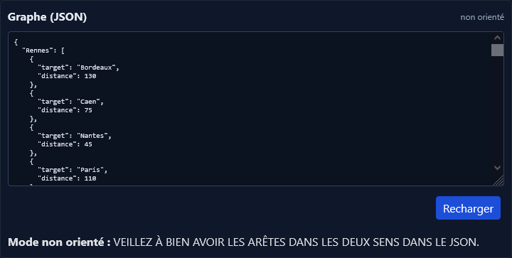
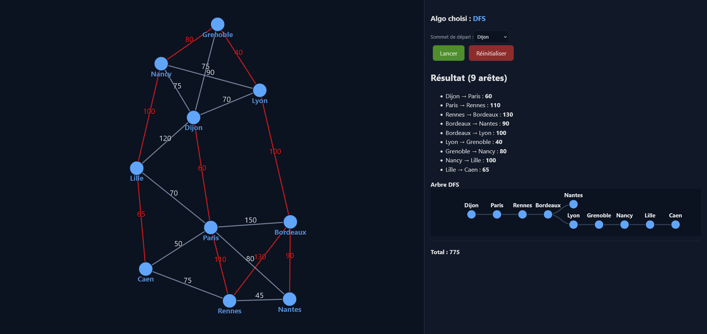
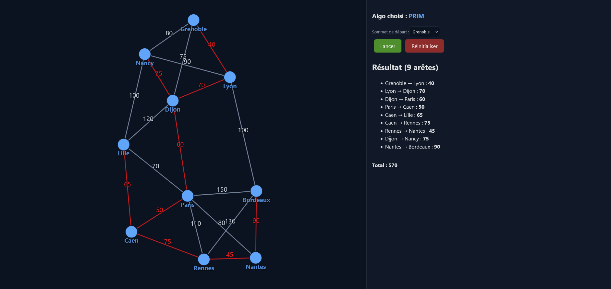
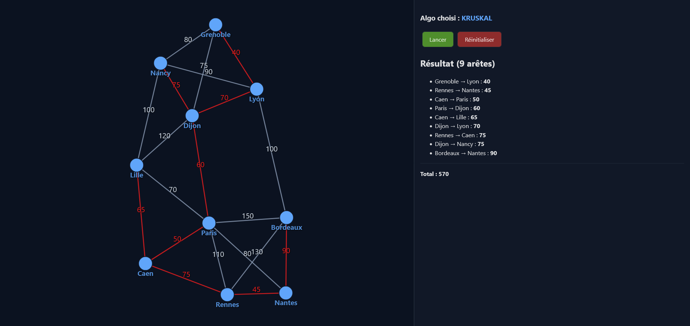
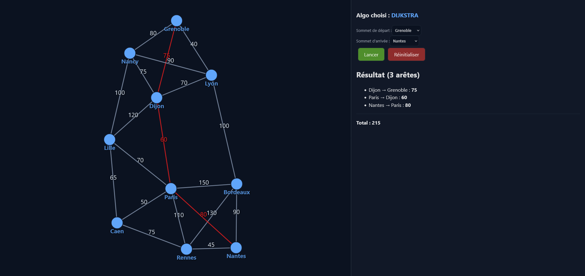
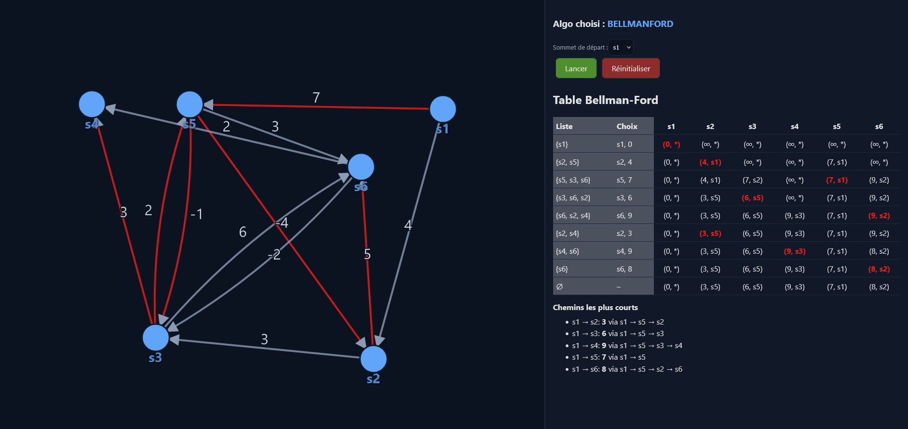
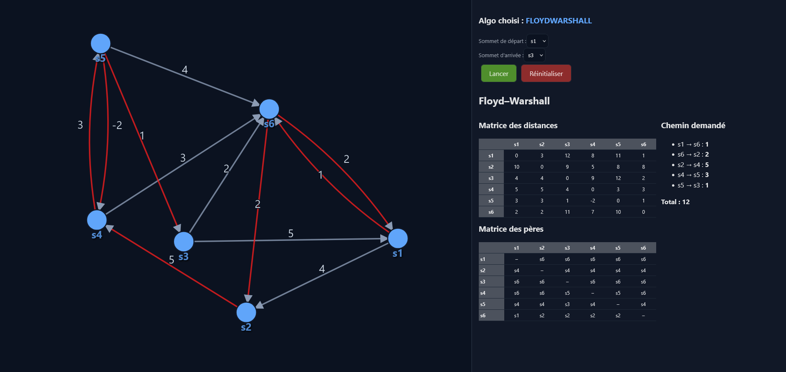

# TheoryGrapht : Rapport de Projet

Auteurs : Yannis BOUTALEB - Florian DE SOUSA

(Pour une meilleure lisibilité du rapport, il est conseillé de le lire sur GitHub ou un interpréteur markdown. Vous avez
tout de même un pdf à disposition, mais il risque d'être moins lisible.)

Github du projet :
https://github.com/Ianouu1/TheoryGrapht

---

## 1/ Contexte et objectifs

**TheoryGrapht** est une application web permettant de visualiser les algorithmes de graphes étudiés en cours. Elle
implémente les algorithmes suivants :

- Parcours en largeur (BFS)
- Parcours en profondeur (DFS)
- Dijkstra
- Kruskal
- Prim
- Floyd-Warshall

---

## 2/ Technologies utilisées & Architecture du projet

Pour ce projet, nous avons choisi de le réaliser en utilisant les technologies suivantes :

### 2.1/ Back-end

- **Java 17** : pour le développement back-end, car il s'agit du langage qu'on maîtrise le mieux
- **Spring Boot** / **Swagger**: pour exposer une API REST permettant de communiquer avec le front-end
- **Maven** : pour la gestion des dépendances et la construction du projet

### 2.2/ Front-end

- **Vite** / **React** : Pour le front-end de l'application web
- **Node.js** : pour gérer les dépendances front-end et lancer le serveur front-end
- **d3.js** : pour la visualisation dynamique des graphes et des résultats des algorithmes

### 2.3/ Architecture back-end

L’architecture **back-end** adoptée pour ce projet suit une organisation modulaire afin de séparer clairement les
responsabilités. Nous retrouvons ainsi les couches suivantes :

* Contrôleur
* Modèle
* Service
* Utilitaires

Cette structure favorise la lisibilité, la maintenabilité et l’évolutivité du code en isolant la logique métier, les
modèles de données et les points d’entrée de l’API.

#### 2.3.1/ Contrôleur

Cette couche expose les endpoints de l'API que nous avons créé pour le projet. Elle reçoit des requêtes HTTP du frontend
et renvoie les réponses appropriées pour être interprétées visuellement.

#### 2.3.2/ Modèle

Cette couche regroupe les structures de données principales utilisées dans l'application. Particulièrement celle
représentant le graphe, les sommets et les arêtes.

```java
public class Vertex {
    private String name;
}
```

```java
public class Edge {
    private Vertex source;
    private Vertex target;
    private int weight;
}
```

```java
public class Graph {
    private Vertex[] vertices;
    private Edge[] edges;
    private Map<Vertex, List<Edge>> adjacencyList;
}
```

Elle contient également d'autres classes pour faciliter la manipulation des graphes et des résultats des algorithmes.

#### 2.3.3/ Service

Cette couche implémente les algorithmes de graphes étudiés (BFS, DFS, Dijkstra, Kruskal, Prim, Floyd-Warshall). Certains
algorithmes ont des méthodes supplémentaires afin d'afficher plus de détails sur leur exécution (matrices, tableaux,
etc.)

#### 2.3.4/ Utilitaires

Cette couche met à disposition des outils complémentaires pour le projet, tels que le chargement JSON et des fonctions
utilitaires diverses.

---

## 3/ Dépendances & Déploiement du projet

### 3.1/ Back-end

Pour démarrer le projet, il est nécessaire d'installer les dépendances requises. A savoir :

- Java 17
- Maven
- Node.js et npm

Le projet utilise Maven pour la gestion des dépendances.
Pour installer les dépendances, exécutez la commande suivante dans le répertoire du projet :

```bash
mvn clean install
```

Alternativement, vous pouvez utiliser l'interface graphique de IntelliJ IDEA pour installer les dépendances Maven :



Il faut aussi ensuite lancer la classe Main.java afin de démarrer le serveur Spring Boot.

### 3.2/ Front-end

Enfin, il faut installer les dépendances front-end en se plaçant dans le dossier "**frontend**" et en exécutant la
commande
suivante :

```bash
npm install
```

Maintenant, toujours dans le dossier "**frontend**", lancez le serveur de développement avec la commande :

```bash
npm run dev
```

Ainsi un Swagger est disponible à l'adresse http://localhost:8080/swagger-ui.html pour tester l'API. Vous pouvez
consulter les routes mises à disposition ainsi que leur documentation.



Cette API met à disposition les endpoints des algorithmes implémentés dans le projet, en plus de quelques endpoints
complémentaires pour avoir des résultats tel que des matrices ou tableaux.

Le front-end de l'application est quant à lui accessible à l'adresse http://localhost:5173.

---

## 4/ Structure des graphes en JSON

### 4.1/ Graphes non-orientés

La structure JSON des graphes **non-orientés** utilisée dans le projet veut qu'on déclare chaque arête dans les deux
sens. Par exemple, le **graphe complet** suivant :

```json
{
  "A": [
    {
      "target": "B",
      "distance": 5
    },
    {
      "target": "C",
      "distance": 10
    }
  ],
  "B": [
    {
      "target": "A",
      "distance": 5
    },
    {
      "target": "C",
      "distance": 3
    }
  ],
  "C": [
    {
      "target": "A",
      "distance": 10
    },
    {
      "target": "B",
      "distance": 3
    }
  ]
}
```

### 4.2/ Graphes orientés

La structure JSON des graphes **orientés** utilisée dans le projet veut qu'on déclare chaque arc tel que le **graphe
orienté** suivant :

```json
{
  "A": [
    {
      "target": "B",
      "distance": 5
    },
    {
      "target": "C",
      "distance": 10
    }
  ],
  "B": [
    {
      "target": "C",
      "distance": 3
    }
  ],
  "C": []
}
```

### 4.3/ Outil front-end d'import de graphes JSON

Pour faciliter le changement de graphes, nous avons implémenté un outil coté front-end pour importer des JSON de
graphes.



---

## 5/ Algorithmes implémentés

Cette section présente le principe, la complexité et les cas d'usage de chaque algorithme.

| Algorithme     | Complexité     | Cas d'usage                                                         | Structure clé       |
|----------------|----------------|---------------------------------------------------------------------|---------------------|
| BFS            | O(V+E)         | Parcours, distances non pondérées                                   | Queue               |
| DFS            | O(V+E)         | Détection de cycles, ordonnancement                                 | Pile (stack)        |
| Prim           | O(E log V)     | Arbre couvrant minimal                                              | PriorityQueue       |
| Kruskal        | O(E log E)     | Arbre couvrant minimal                                              | Union-Find          |
| Dijkstra       | O((V+E) log V) | Plus court chemin (poids ≥ 0)                                       | PriorityQueue       |
| Bellman-Ford   | O(V·E)         | Plus court chemin avec poids négatifs, détection de cycles négatifs | Tableau (distances) |
| Floyd-Warshall | O(V³)          | Tous les plus courts chemins                                        | Matrice             |

### 5.1/ Parcours en largeur (BFS)

Principe : explore par couches depuis une source. Invariant : lorsqu'un sommet est extrait de la file, la distance
calculée est minimale en nombre d'arêtes. Utilisations : distances non pondérées, composantes connexes, découverte de
niveaux. 

Complexité : O(V+E).

Dans notre implémentation de l'algorithme, nous sélectionnons les sommets par ordre d'apparition dans le json et non par
ordre alphabétique.


Ici, on commence par la ville de départ, puis on explore ses voisins directs avant de passer aux voisins de ces
derniers.

### 5.2/ Parcours en profondeur (DFS)

Principe : exploration récursive/itérative en profondeur. Invariants : temps d'entrée/sortie utiles pour détection de
cycles et topologie (DAG). 

Complexité : O(V+E).

De la même manière que pour BFS, on sélectionne les sommets par ordre d'apparition dans le json et non par ordre
alphabétique.



Ici, on commence par la ville de départ, puis on explore son premier descendant avant de passer aux descendants de ce
dernier, et ainsi de suite.

### 5.3/ Prim (arbre couvrant minimal)

Principe : croissance d'un sous-ensemble de sommets en choisissant à chaque étape l'arête de coupe minimale via
PriorityQueue.

Complexité : O(E log V).



Ici, on choisit une ville puis on sélectionne l'arête de coût minimal vers un sommet adjacent et ainsi de suite en
évitant les cycles jusqu'à ce que tous les sommets soient connectés.

### 5.4/ Kruskal (arbre couvrant minimal)

Principe : tri des arêtes par poids croissant et ajout si les extrémités sont dans des composantes disjointes (
Union-Find).

Complexité : O(E log E).



Ici, on sélectionne les arêtes de coût minimal en évitant de créer des cycles, jusqu'à ce que tous les sommets soient
connectés.

### 5.5/ Dijkstra (plus court chemin, poids ≥ 0)

Principe : relaxation itérative des arêtes avec sélection du sommet non traité le plus proche via une file de priorité.

Complexité : O((V+E) log V) avec tas binaire. Préconditions : poids non négatifs.



Ici, on choisit une ville, puis on explore le voisin de coût minimal en notant les voisins découverts, et on met à joue
à chaque amélioration chaque voisin connu.

### 5.6/ Bellman-Ford

Principe : relaxation répétée de toutes les arêtes pendant V−1 itérations afin de garantir la meilleure distance
possible vers chaque sommet, même en présence de poids négatifs. Contrairement à Dijkstra, il n'utilise pas de structure
de priorité mais met systématiquement à jour les distances pour chaque arête. Capacité supplémentaire : détection des
cycles négatifs, en vérifiant s'il reste des améliorations possibles après les V−1 passages.

Complexité : O(V·E). Plus lent que Dijkstra, mais peut traiter les graphes avec des poids négatifs.



Ici, on fait une file des sommets à traiter en y ajoutant chaque sommet adjacent rencontré pour chaque étape, on chosit
les sommets dans l'ordre de la file et on met à
jour les distances.

### 5.7/ Floyd-Warshall (tous les plus courts chemins)

Principe : DP sur triples boucles mettant à jour la matrice des distances par l'intermédiaire de sommets k.

Complexité : O(V^3).

Peut être complété d'une matrice des prédécesseurs pour reconstruire les chemins.



Ici, on calcule les plus courts chemins entre toutes les paires de villes en considérant chaque ville intermédiaire
possible, en rédigeant une matrice des distances.

---

## 6/ Fonctionnement global de l'application

Jeu de données : graphe de villes françaises donné dans le sujet (Paris, Lille, Rennes, Bordeaux...)

1. Envoie du graphe (avec possiblement des sommets sélectionnés) à l'algorithme choisi. **(front-end → Controller)**
2. Exécution de l'algorithme demandé sur le graphe. **(Controller → Service)**
3. Résultat de l'execution : détails de l'algorithme (arêtes parcourues, distances, matrices...) **(Service →
   Controller)**
4. Interprétation des résultats dans l'interface utilisateur. **(Controller → front-end)**

| Algorithme       | Paramètres                | Résultat (ex.)                      | Mesure (valeur)    | Interprétation (qualitative)      |
|------------------|---------------------------|-------------------------------------|--------------------|-----------------------------------|
| BFS              | source=Rennes             | Edges parcourues = [...]            | Niveau max = …     | Couverture rapide des voisins     |
| DFS              | source=Rennes             | Edges parcourues = [...]            | Profondeur max = … | Exploration en profondeur         |
| Prim             | start=Paris               | Arêtes MST = {...}                  | Coût total = …     | Même coût attendu que Kruskal     |
| Kruskal          | -                         | Arêtes MST = {...}                  | Coût total = …     | Comparé à Prim, très proche       |
| Dijkstra         | start=Bordeaux,end=Lille  | Chemin = [Bordeaux, Paris, Lille]   | Distance = 810     | Cohérent avec la carte            |
| **Bellman-Ford** | start=Rennes,end=Bordeaux | Chemin = [Rennes, Nantes, Bordeaux] | Distance = …       | Supporte poids négatifs / robuste |
| Floyd-Warshall   | start=Paris,end=Rennes    | Matrice dist[i][j]                  | Δ vs Dijkstra = 0  | All-pairs cohérent                |

---

## 7/ Interprétation des résultats

### 7.1/ BFS et DFS

BFS et DFS explorent le graphe différemment. BFS atteint rapidement les sommets proches (niveaux faibles), tandis que
DFS
plonge profondément avant de revenir en arrière. Les arêtes parcourues diffèrent selon la stratégie (largeur vs
profondeur).

### 7.2/ Kruskal vs Prim

Kruskal et Prim trouveront des arbres couvrants minimaux de même coût total. Les arêtes sélectionnées peuvent différer
selon la stratégie (global vs local).

### 7.3/ Dijkstra vs Bellman-Ford

Dijkstra calcule efficacement les plus courts chemins sans poids négatifs grâce à une sélection gloutonne des distances
minimales.
Bellman-Ford, plus coûteux, gère les poids négatifs et signale les cycles négatifs lorsqu'ils existent.

### 7.4/ Floyd-Warshall

Floyd-Warshall fournit une matrice complète des plus courts chemins entre toutes paires de sommets. Les distances
correspondent à celles obtenues par Dijkstra pour chaque paire, confirmant la cohérence des résultats.

---

## 8/ Améliorations possibles

Pour modifier le graphe, nous demandons à l'utilisateur de fournir un nouveau JSON en respectant la structure définie.

Une amélioration possible serait d'ajouter une interface graphique pour éditer le graphe directement dans l'application.
Cette décision permettrait à l'utilisateur de prendre en main plus facilement l'application sans avoir à manipuler des
fichiers JSON.

---

## 9/ Conclusion

Ce projet nous a permis de découvrir d3.js, une bibliothèque front-end utile pour créer des graphes. Nous avons pu
exposer nos compétences en termes d'architecture back-end avec Spring Boot et en implémentation d'algorithmes de graphes
en Java. Ainsi qu'en developpement front-end avec une interface graphique qui utilise l'API back-end et réinterprète les
données reçues.